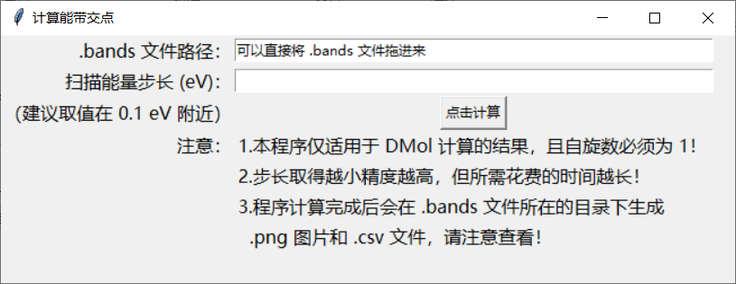
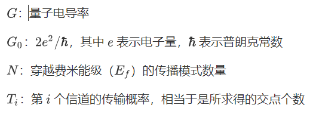
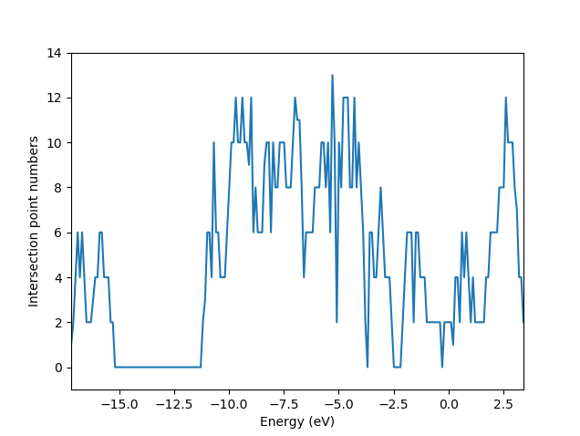

# 计算量子电导率（*G*）函数

## 1 使用前须知

> 之前导师说可以用这个脚本处理一些数据然后放在文章里的，但后来也一直没有用，所以脚本写的比较粗糙，没有再进行优化，如果以后对别人有用或者我自己要用的话，会再做的精细一点。

本程序是在 Python 3.7 的基础下完成的，运行本程序的源码时你需要安装 python 3.7，同时还需要安装以下第三方库：

* numpy
* csv
* matplotlib
* TkinterDnD2（如果文件路径很长的话输起来比较费劲，所以有了拖动文件生成路径的想法，正好这个库可以支持文件的拖动操作）

当然你也可以选择直接运行打包好的应用程序。

## 2 使用方法

脚本已经打包成了可执行程序（.exe），如果你没有安装 python 的话，可以选择执行应用程序；当然，如果你已经安装了 python 3.7，既可以选择执行 python 文件（.py），也可以选择执行应用程序（.exe）。上传的源码只是方便你修改。

**具体步骤：**

1. 启动程序，程序界面如下图所示
2. 将之前计算得到名为 xxx_BandStr.bands 的文件拖入到路径栏中
3. 输入能量扫描的步长，这个可以控制结果的精细程度，需要不断调整以达到你觉得最优的效果
4. 程序运行完成后会在程序所在目录下生成一个 xxx_BandStr.csv 和 xxx_BandStr.png 文件

## 3 使用后须知

这个脚本实际上是根据你所指定的扫描能量步长生成一个一维矩阵，其中最小值和最大值来源于你计算的能带结构，然后再求出每个能量值下与每条能带的交点数，最后根据 Landauer 公式换算得到量子电导率（$G$）函数。

### Landauer 公式

>Github 中无法显示 latex 公式，所以只好用图片了

**这是文献中的插图：**

**这是脚本做出来的图（使用的数据不同）：**

# 4 参考文献

[1] He, C., Zhang, J. H., Zhang, W. X., & Li, T. T. (2019). GeSe/BP van der Waals heterostructures as promising anode materials for potassium-ion batteries. *The Journal of Physical Chemistry C*, *123*(9), 5157-5163. 

[2] Van Wees, B. J., Van Houten, H., Beenakker, C. W. J., Williamson, J. G., Kouwenhoven, L. P., Van der Marel, D., & Foxon, C. T. (1988). Quantized conductance of point contacts in a two-dimensional electron gas. *Physical Review Letters*, *60*(9), 848. 

[3] Olesen, L., Lægsgaard, E., Stensgaard, I., Besenbacher, F., Schio, J., Stoltze, P., ... & No, J. K. (1994). Quantized conductance in an atom-sized point contact. *Physical Review Letters*, *72*(14), 2251. 